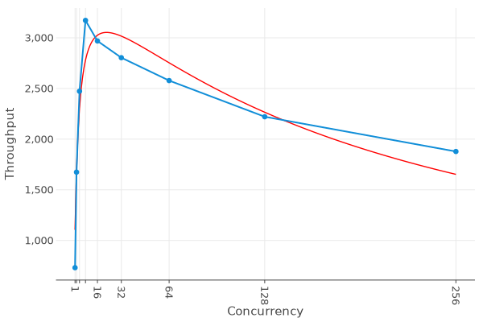
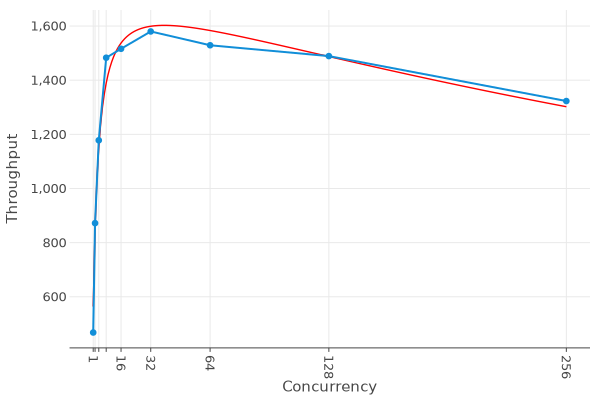
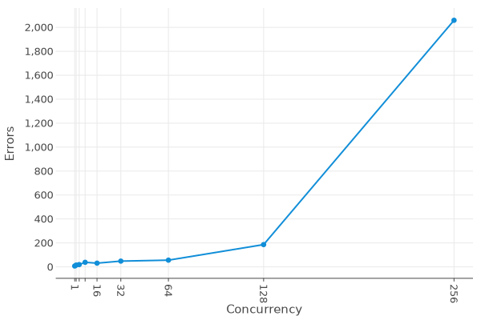

# Group 03 - JWT Ticket

This repository contains the projects that implement specifications for Lab02.

## Stateless validator

Each ticket is validated against the token only, therefore raising errors in these cases:

- Token expired: the `exp` field is before the current date
- Wrong signature: the token has been manipulated
- Unsupported zone: the zone provided with the ticket is not in the validity zones (`vz`) of the ticket

### USL

The plot of the behavior of the application under different load is the following

As it can be seen the plot stays more or less constant even at 256 concurrent clients. This is due to the fact that the
only bottleneck of this implementation is the speed of the processor the server is run on

## Stateful validator

Each ticket is validated with the same process of the stateless version but in addition it is forbidden to validate the
same ticket twice. Hence the validation requires to check against all the validated tickets if the current one is
already present (each ticket is identified by the `sub` field)

### USL

The plot of the behavior of the application under different load is the following

This version rapidly decreases just after 16 concurrent clients. This is due to the fact that with the increasing number
of requests, the number of validated tickets increases too and that the single source of truth for the already validated
tickets is a shared object that needs to be locked by each thread.

### Stateful flags variations

#### Keepalive flags

The graph below shows the performances of the system when the client requests a keepalive connection with the server. It can be seen that the throughput is way higher than the previous examples but this value tends to decrease when the number of clients increase (keepalive is usefule when lots of data is exchanged with few clients. With more clients that makes fewer requests this spread is far less noticeable)

#### Timeout flags

The graph below shows the performances of the system when the client sets a timeout of 100ms on the connection with the server. Performances tend to decrease with the number of clients due to the fact that while the server is busy serving other clients the timeout will expire and more errors will be detected.

The graph below shows the number of errors in the experiment with the timeout flag. It can be seen that with 256 clients the server struggles to keep latency low and more and more requests will result in an error

